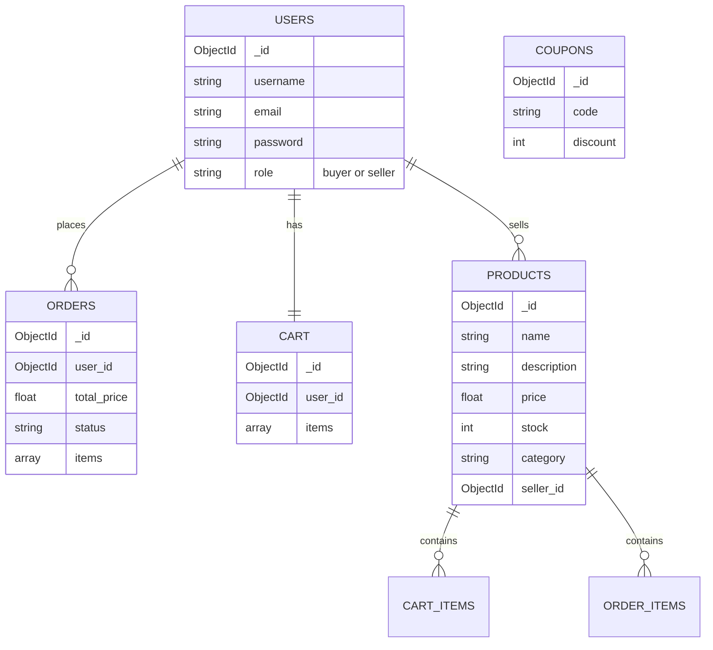

# E-Commerce Marketplace (Full-Stack)

> A modern, fully containerized e-commerce platform featuring a Next.js storefront and a robust Flask backend.

[](https://opensource.org/licenses/MIT)

## Why This Exists

This project provides a production-ready, scalable foundation for an e-commerce marketplace. It abstracts away the complexity of managing authentication, shopping carts, and checkout logic, providing a seamless shopping experience out-of-the-box using a decoupled frontend/backend architecture.

## Tech Stack

- **Frontend:** Next.js (App Router), React, Tailwind CSS, Axios
- **Backend:** Python, Flask, PyMongo, Flask-JWT-Extended, Marshmallow
- **Database:** MongoDB
- **Orchestration:** Docker & Docker Compose

## Quick Start (Docker)

The fastest way to run the entire stack (Frontend, Backend, and Database) is using Docker Compose.

**Prerequisites**: [Docker](https://docs.docker.com/get-docker/) and Git.

1. **Clone the repository**:
   ```bash
   git clone <repository-url>
   cd ecommerce-backend
   ```

2. **Start the application**:
   ```bash
   docker-compose up --build -d
   ```

3. **Access the platform**:
   - **Storefront (Frontend)**: Navigate to `http://localhost:3000`
   - **API (Backend)**: Running at `http://localhost:5000/api/v1`

## Local Development (Without Docker)

If you prefer to run the services individually for development:

### Backend Setup
1. Open a terminal in the project root:
   ```bash
   python3 -m venv .venv
   source .venv/bin/activate
   pip install -r requirements.txt
   ```
2. Create a `.env` file in the root directory:
   ```env
   FLASK_APP=app.py
   FLASK_ENV=development
   MONGO_URI=mongodb://localhost:27017/ecommerce
   JWT_SECRET_KEY=your-secret-key-change-me
   STRIPE_API_KEY=sk_test_fake
   PORT=5000
   ```
3. Run the backend:
   ```bash
   flask run
   ```

### Frontend Setup
1. Open a new terminal in the `frontend` directory:
   ```bash
   cd frontend
   npm install
   ```
2. Create a `.env.local` file in the `frontend` directory:
   ```env
   NEXT_PUBLIC_API_URL=http://localhost:5000/api/v1
   ```
3. Run the frontend:
   ```bash
   npm run dev
   ```

## API Reference

The backend uses a `/api/v1` prefix. All authenticated requests require a JWT access token in the header.

### Authentication

**Register a new user:**
```bash
curl -X POST http://localhost:5000/api/v1/auth/register \
  -H "Content-Type: application/json" \
  -d '{
    "username": "john_doe",
    "email": "john@example.com",
    "password": "secure_password",
    "role": "buyer"
  }'
```

**Login:**
```bash
curl -X POST http://localhost:5000/api/v1/auth/login \
  -H "Content-Type: application/json" \
  -d '{
    "email": "john@example.com",
    "password": "secure_password"
  }'
```
> **Note**: Save the returned access token. You will need to replace `YOUR_ACCESS_TOKEN` in subsequent requests with this token string.

### Product Management

**Get all products:**
```bash
curl -X GET "http://localhost:5000/api/v1/products?page=1&per_page=20"
```
> **Note**: The response contains an `_id` field for each product. Use this ID to replace the `PRODUCT_ID` placeholder in cart and order requests.

**Create a product (Seller only):**
```bash
curl -X POST http://localhost:5000/api/v1/products \
  -H "Content-Type: application/json" \
  -H "Authorization: Bearer YOUR_ACCESS_TOKEN" \
  -d '{
    "name": "Smartphone",
    "description": "Latest model smartphone",
    "price": 999.99,
    "category": "Electronics"
  }'
```

### Shopping Cart

**Add item to cart:**
```bash
curl -X POST http://localhost:5000/api/v1/cart \
  -H "Content-Type: application/json" \
  -H "Authorization: Bearer YOUR_ACCESS_TOKEN" \
  -d '{
    "product_id": "PRODUCT_ID",
    "quantity": 1
  }'
```

**View cart:**
```bash
curl -X GET http://localhost:5000/api/v1/cart \
  -H "Authorization: Bearer YOUR_ACCESS_TOKEN"
```

## Error Handling

The API returns standard HTTP status codes combined with structured JSON error responses. The frontend uses an Axios interceptor to catch and handle these errors automatically.

Example Error Response:
```json
{
    "success": false,
    "message": "Validation Error",
    "error": {
        "email": ["Invalid email address"]
    }
}
```

## Database Architecture

The backend is supported by a NoSQL MongoDB schema. 



## License

MIT © E-Commerce Engineering Team
